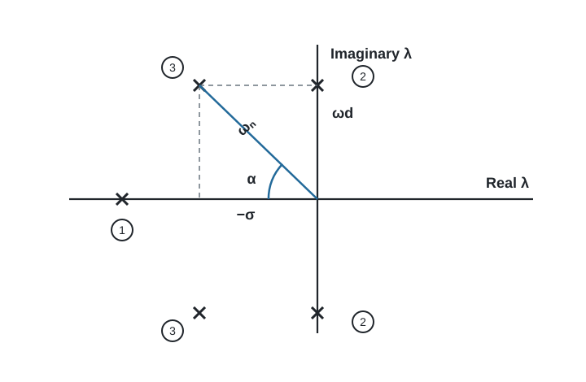
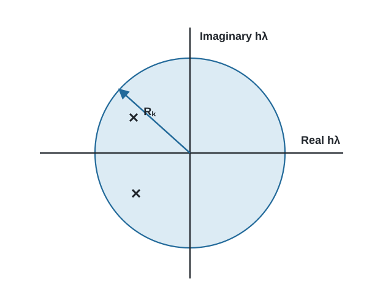
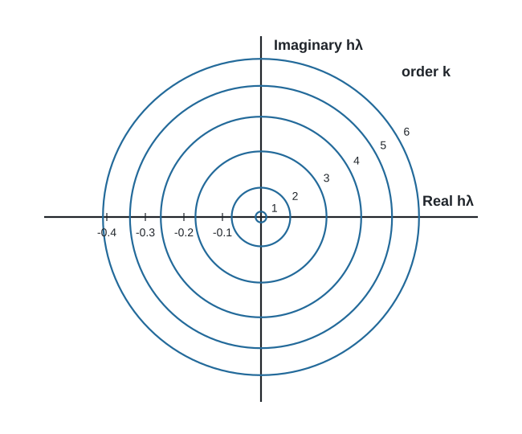
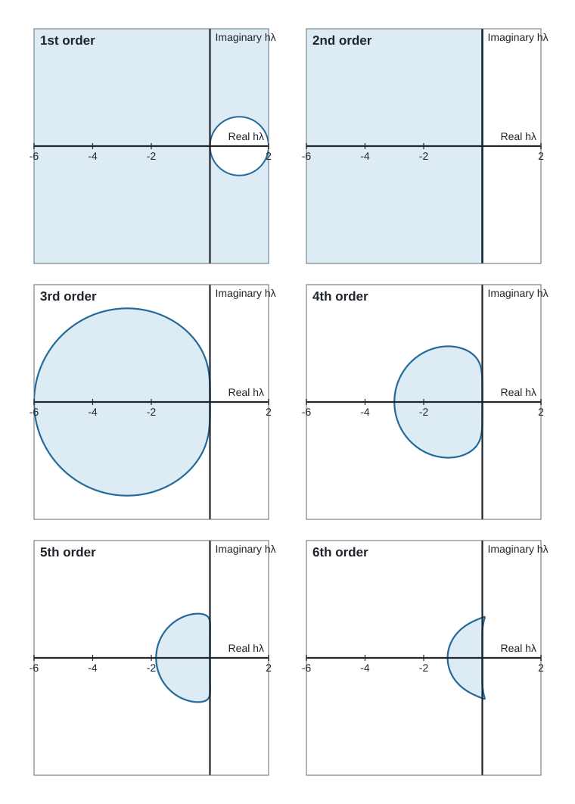
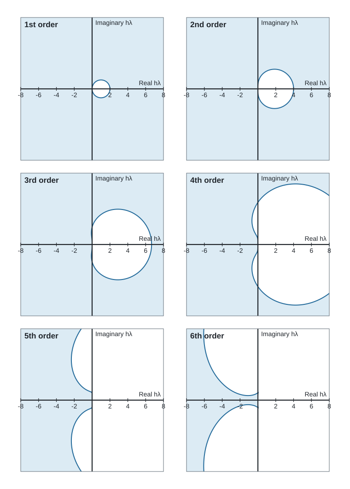
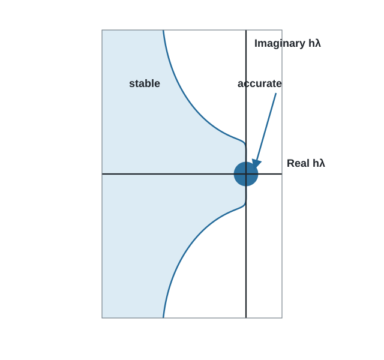
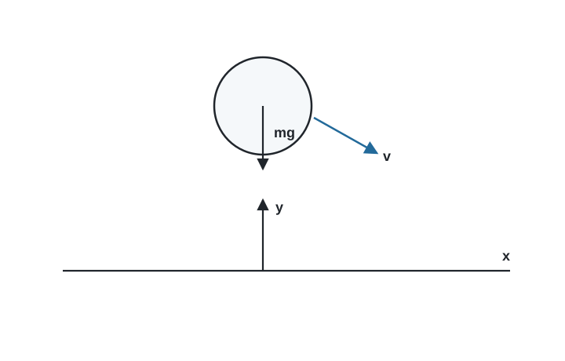
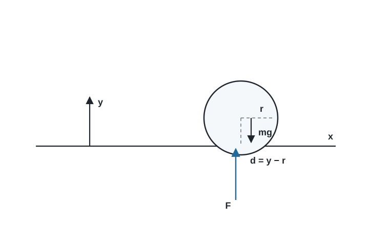
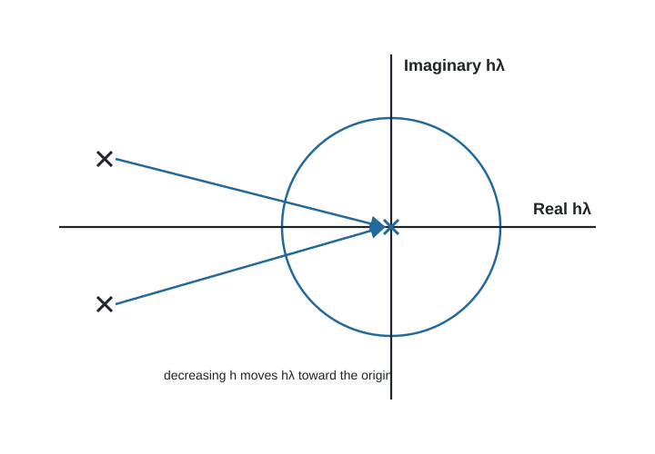

# Numerical Stiffness in Mechanical-System Simulation

Mechanical models often contain motions that occur on very different time
scales. A vehicle body may move appreciably over a second while a tire,
bushing, contact, or flexible connection responds in a few thousandths of a
second. A useful simulation program must resolve a fast response while it is
active without continuing to pay that cost after the response has settled.

This chapter explains why those models are numerically stiff and why a
variable-step BDF integrator is useful for them. It develops the explanation
in the $h\lambda$ plane, where the equations and the integration formula can be
examined together. The discussion is background for both the planar and
spatial modelers; it is not a description of a separate analysis type.

The presentation develops ideas first described by Wielenga [1]. The text,
figures, and organization here were prepared for PracticalMechanicalSimulation.

## 1. Local behavior of a mechanical model

A nonlinear mechanical model can be examined locally by linearizing its
first-order equations at the current operating point. For an autonomous
system,

$$
\dot y=f(y),
$$

the local perturbation $\delta y$ satisfies

$$
\dot{\delta y}=A\,\delta y,
\qquad
A=\left.\frac{\partial f}{\partial y}\right|_{y_0}.
$$

If $A$ has a complete set of eigenvectors, the perturbation can be written as
a sum of modal components,

$$
\delta y(t)=\sum_i a_i\phi_i e^{\lambda_i t}.
$$

Each eigenvalue $\lambda_i$ describes the local time behavior of one
component. A negative real eigenvalue gives a decaying nonoscillatory
component. A complex pair gives an oscillatory component whose decay rate is
set by its real part and whose frequency is set by its imaginary part.

*Figure 1. Typical eigenvalue locations. Point 1 is nonoscillatory and damped,
points 2 are undamped, and points 3 are damped and oscillatory.*

For a complex pair written as

$$
\lambda=-\sigma\pm j\omega_d,
$$

define

$$
\omega_n=|\lambda|,
\qquad
\zeta=\frac{\sigma}{\omega_n}=\cos\alpha.
$$

The magnitude $|\lambda|$ gives a measure of speed. A component with a large
eigenvalue magnitude can change rapidly. The damping ratio $\zeta$ determines
how quickly an oscillatory component dies away. Both properties matter to the
integrator.

The eigenvalues of a nonlinear system are not fixed. They change with the
configuration, velocity, contact state, and force-law slopes. A contact may
introduce a fast pair of eigenvalues when it closes and remove that pair when
it opens. A bushing may remain present throughout a run, but its fast motion
may be important only during an initial transient.

## 2. Accuracy in the $h\lambda$ plane

Consider one eigencomponent,

$$
\dot x=\lambda x.
$$

Let an integration formula have order $k$, step size $h$, and local error
constant $C_k$. Its local truncation error has the form

$$
e_t\leq C_k h^{k+1}\left|x^{(k+1)}(a)\right|,
$$

for some point $a$ in the step. Successive differentiation of the test
equation gives

$$
x^{(k+1)}=\lambda^{k+1}x.
$$

The relative local error is therefore bounded by

$$
\frac{e_t}{|x|}\leq C_k|h\lambda|^{k+1}.
$$

If the allowed relative error is $E_r$, define

$$
R_k=\left(\frac{E_r}{C_k}\right)^{1/(k+1)}.
$$

Accuracy requires approximately

$$
|h\lambda|\leq R_k.
$$

This is a circle in the complex $h\lambda$ plane.

*Figure 2. A simple accuracy region in the $h\lambda$ plane.*

The $h\lambda$ plane combines the physical time scale and the numerical step
size. Increasing $h$ moves every eigenvalue radially away from the origin.
Decreasing $h$ moves it toward the origin. A variable-step integrator reduces
the step until every component that matters to the current solution is inside
its applicable accuracy region.

Figure 3 shows the accuracy radii for BDF formulas at $E_r=10^{-4}$ using the
error constants employed in the original analysis. The higher-order formulas
have larger accuracy regions for the same nominal error tolerance.

*Figure 3. BDF accuracy limits for orders one through six at $E_r=10^{-4}$.*

The radii used in the figure are:

| Order $k$ | 1 | 2 | 3 | 4 | 5 | 6 |
|---:|---:|---:|---:|---:|---:|---:|
| $R_k$ | 0.014 | 0.076 | 0.17 | 0.26 | 0.34 | 0.41 |

These values describe accuracy, not stability. A component outside an
accuracy region may still be computed without numerical growth if it lies in
a stable region.

## 3. Stability of a multistep formula

Write a linear multistep formula as

$$
\sum_{i=-1}^{p}a_i x_{n-i}
+h\sum_{i=-1}^{p}b_i\dot x_{n-i}=0.
$$

Substituting $\dot x=\lambda x$ and trying a discrete solution $x_n=z^n$
gives the characteristic equation

$$
P_a(z)+h\lambda P_b(z)=0,
$$

where

$$
P_a(z)=\sum_{i=-1}^{p}a_i z^{p-i},
\qquad
P_b(z)=\sum_{i=-1}^{p}b_i z^{p-i}.
$$

The numerical solution is stable when all roots $z$ remain within the unit
circle, with the usual qualification for simple roots on the boundary. The
boundary of the stability region can therefore be drawn by placing $z$ on
the unit circle,

$$
z=e^{j\theta},
$$

and evaluating

$$
h\lambda=-\frac{P_a(z)}{P_b(z)},
\qquad 0\leq\theta\leq2\pi.
$$

This construction is used to generate Figures 4–6. The axes have equal scale,
so the plotted circles and angles have their actual geometry in the
$h\lambda$ plane.

*Figure 4. Stability regions for Adams–Moulton formulas of orders one through
six. The shaded portions are stable.*

*Figure 5. Stability regions for BDF formulas of orders one through six. The
shaded portions are stable.*

The Adams–Moulton formulas have attractive accuracy properties, but their
stable regions become limited as order increases. The BDF formulas retain a
large stable region around the negative real axis. The first- and second-order
BDF formulas include the complete left half-plane. Higher orders admit a
narrower wedge as the order increases.

An integration formula is called $A(\alpha)$-stable when its stable region
contains the infinite wedge within angle $\alpha$ of the negative real axis.
For the BDF family, the limiting angles and corresponding damping ratios are
approximately:

| BDF order | 1 | 2 | 3 | 4 | 5 | 6 |
|---:|---:|---:|---:|---:|---:|---:|
| $\alpha$ (degrees) | 90 | 90 | 86 | 76 | 50 | 16 |
| Minimum $\zeta=\cos\alpha$ | 0 | 0 | 0.07 | 0.24 | 0.64 | 0.96 |

This explains why damping and integration order interact. A highly damped
fast component can remain in a high-order BDF stability region as the step
size increases. A lightly damped component may force the integrator to use a
smaller step or a lower order even after its amplitude has become small.

## 4. Active and inactive components

An eigenvalue alone does not determine the required step size. The amplitude
of its component in the current solution also matters.

An **active component** is contributing appreciably to the motion or to the
local error estimate. It must be computed accurately. An **inactive
component** has decayed, has not been excited, or has negligible amplitude in
the current solution. It need not be accurate, but it must remain numerically
stable.

Figure 6 superposes the fifth-order BDF stability boundary and its accuracy
circle. A fast inactive component may move far outside the accuracy circle as
$h$ grows. The computation can still proceed if the component stays in the
shaded stable region.

*Figure 6. Combined accuracy and stability regions for fifth-order BDF.*

This distinction leads to a useful local stiffness measure. Let the numerator
be the largest magnitude among inactive eigenvalues and the denominator be
the largest magnitude among active eigenvalues:

$$
SR=
\frac{\max |\lambda_{\text{inactive}}|}
     {\max |\lambda_{\text{active}}|}.
$$

When every fast component is active, the system may be fast but it is not
stiff in this sense. Every reasonable integrator must resolve that fast
motion. When the fast components have become inactive while slower components
continue to evolve, $SR$ can become large. A stiff integrator may then choose
its step from the slower active motion, while a method with limited stability
may remain tied to the fast inactive eigenvalues.

Stiffness is therefore not a permanent label attached to a model. A model can
pass through several regimes:

1. An impact or rapid startup transient activates the fastest components.
2. Damping removes their energy.
3. The fast eigenvalues remain in the local equations, but their components
   become inactive.
4. A later event may excite them again.

## 5. A ball above and on a table

A falling ball gives a compact illustration because contact changes the local
equations without changing the body itself.

*Figure 7. A ball moving freely above a table.*

Above the table, horizontal and vertical translation are independent:

$$
m\ddot x=0,
\qquad
m\ddot y=-mg.
$$

In first-order form, the vertical subsystem is

$$
\begin{bmatrix}
\dot v\\
\dot y
\end{bmatrix}
=
\begin{bmatrix}
0&0\\
1&0
\end{bmatrix}
\begin{bmatrix}
v\\
y
\end{bmatrix}
+
\begin{bmatrix}
-g\\
0
\end{bmatrix}.
$$

Its homogeneous eigenvalues are zero. A second-order method can represent the
constant-acceleration trajectory exactly apart from arithmetic and event
location. There is no fast elastic mode while the ball is clear of the table.

Now represent the normal contact by a linear spring and damper. If the sphere
radius is $r$, the force during penetration is

$$
F_y=-K(y-r)-Cv,
\qquad y-r<0.
$$

*Figure 8. Contact introduces stiffness and damping in the normal direction.*

The vertical equations during contact become

$$
\begin{bmatrix}
\dot v\\
\dot y
\end{bmatrix}
=
\begin{bmatrix}
-C/m&-K/m\\
1&0
\end{bmatrix}
\begin{bmatrix}
v\\
y
\end{bmatrix}
+
\begin{bmatrix}
-g+Kr/m\\
0
\end{bmatrix}.
$$

The vertical subsystem now has a complex-conjugate eigenvalue pair. During
impact and rebound, the corresponding component is active and the step size
must be small enough to resolve it. If the ball later rolls smoothly on the
surface, the same fast eigenvalues remain, but the normal component is nearly
inactive. A BDF method can then increase its step while preserving stable
normal contact.

*Figure 9. Changing the step size moves $h\lambda$ radially in the complex
plane.*

This example also shows why a stiff integrator does not eliminate the cost of
impact. It must resolve fast motion when that motion is present. Its advantage
appears after the transient, when the fast local equations remain but the fast
component no longer controls the physical solution.

## 6. Consequences for mechanical modeling

Stiff integration changes which idealizations are practical.

### 6.1 Bushings instead of unnecessary ideal joints

A stiff bushing introduces fast translational or rotational modes. Those modes
must be resolved when excited, but they need not restrict every later step.
This makes it practical to retain physically meaningful compliance rather
than replacing every connection with an ideal kinematic constraint.

The stiffness should still be chosen from acceptable deformation and load,
not made arbitrarily large. Excessive stiffness increases conditioning demands
without improving the useful model.

### 6.2 Contact represented by force

A one-sided contact is naturally represented by a force that activates as the
gap closes. The force law may be very stiff and may change its tangent rapidly
near engagement. BDF integration helps after engagement, but smooth force
activation, suitable damping, and useful output near failure remain important.

### 6.3 Damping has two numerical roles

Damping reduces the amplitude of fast transients, allowing their components
to become inactive. It also moves complex eigenvalues closer to the negative
real axis, where the higher-order BDF formulas have more useful stability.
Damping should represent plausible physical dissipation, but its numerical
effect is worth understanding when selecting force-law parameters.

### 6.4 Static equilibrium removes avoidable transients

A vehicle or supported mechanism normally begins a dynamic event near an
equilibrium configuration. Starting from an arbitrary unloaded geometry can
excite suspension, tire, bushing, and contact modes simultaneously. Solving
static equilibrium first removes much of that artificial startup motion. The
dynamic simulation can then begin with the intended velocities applied to the
equilibrated configuration.

## 7. Implicit solution and sparse Jacobians

Extended stability is not free. At a large step size, simple fixed-point
iteration is generally inadequate. A stiff integrator solves an implicit
equation by a Newton-like corrector. Each correction requires a Jacobian and a
linear solve.

For a mechanical model, this is not merely an integrator detail. Mass,
inertia, constraints, reactions, kinematic definitions, and constitutive
forces all contribute to the correction matrix. Eliminating variables through
a recursive coordinate reduction can make those derivatives difficult to
form. The architecture used here instead lets each component contribute local
implicit equations and local Jacobian entries to one sparse assembled system.

PracticalMechanicalSimulation uses a variable-step, variable-order BDF method
with these properties:

- the complete simultaneous solution is predicted from accepted history;
- Newton correction enforces the mechanical equations at the new time;
- analytical sparse Jacobian contributions are used when available;
- UMFPACK supplies sparse direct factorization;
- symbolic factorization is reused while the sparsity pattern is unchanged;
- numerical factorization may be reused for modified-Newton corrections and
  nearby steps;
- discontinuities and contact transitions can refresh or restart the history
  policy when necessary; and
- integrated physical states control local error by default, while algebraic
  reactions remain available to improve prediction and correction.

The implementation currently uses BDF orders one through five. Sixth order is
included in the historical stability comparison because it makes the loss of
the stable wedge especially clear, not because the present integrator uses it.

For implementation details, see the
[Julia DDASSL conversion](../../architecture/common/julia-ddassl-conversion.md)
and the
[mathematical architecture](../../architecture/common/mathematical-architecture.md).

## 8. Practical interpretation

Numerical stiffness does not mean that the computed motion must look rough or
rapid. It often produces the opposite symptom: a smooth solution that forces a
nonstiff method to take unexpectedly small steps. The useful diagnostic
questions are:

- Is a fast physical component actually active?
- Is a small step required by accuracy, stability, a nonsmooth force law, or a
  poorly conditioned solve?
- Has enough physical damping been modeled for a fast transient to decay?
- Is the chosen BDF order suitable for the damping ratio of the fast modes?
- Would static equilibrium remove an artificial startup transient?
- Is the model using extreme stiffness where a realistic compliance would be
  better?

A stiff integrator does not excuse a poor model. It allows a good model to
retain physically important fast behavior without forcing that behavior to
govern the cost of the entire simulation.

## Reference

[1] T. J. Wielenga, “The Effect of Numerical Stiffness on the Simulation of
Mechanical Systems,” *Proceedings of the 1986 ASME International Computers in
Engineering Conference and Exhibition*, Vol. 1, Chicago, Illinois, 1986,
pp. 369–378.
